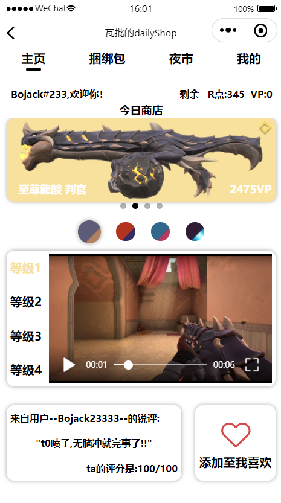
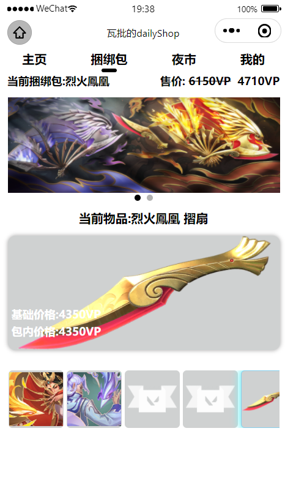
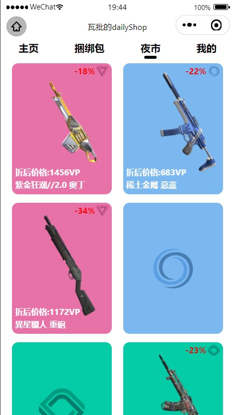
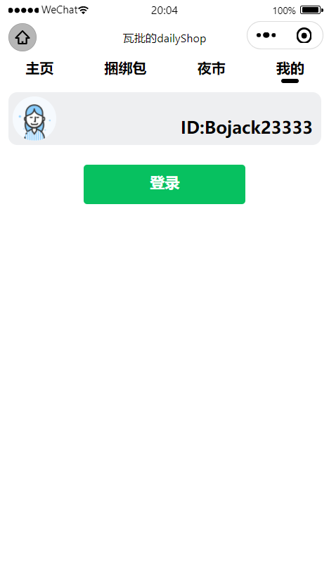
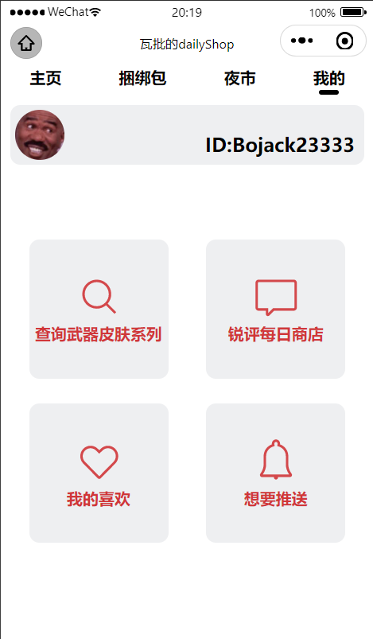
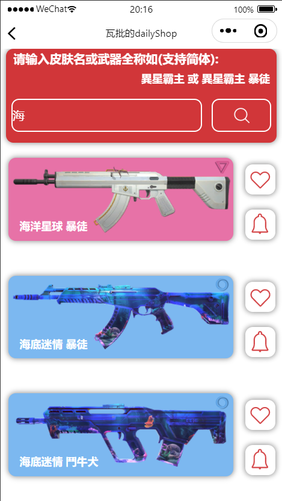
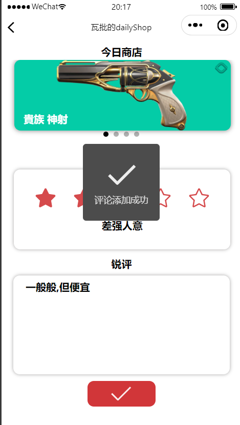
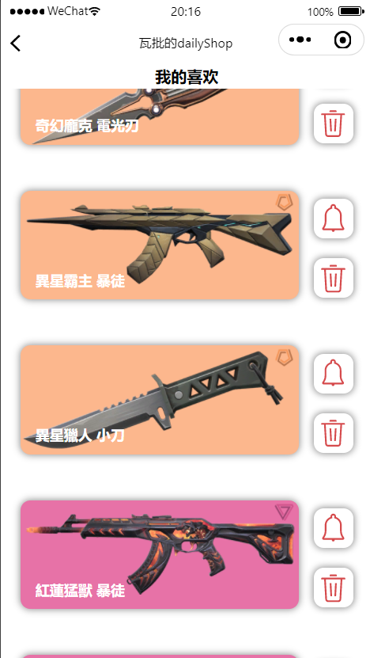
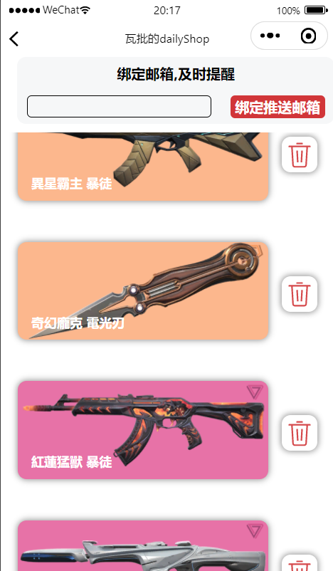
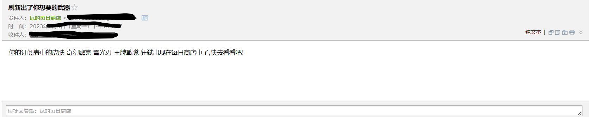

# 注意！！！
由于拳头更新登录验证机制，又因本人能力有限，该小程序已无法使用！！！
# 前言
该项目是一个基于原生微信小程序的瓦洛兰特每日商店,目的是用于实现通过微信小程序查询瓦洛兰特游戏的的每日商店,此外实现订阅皮肤列表每天通过邮箱推送是否出现在每日商店.

# 使用方法

## 运行

克隆项目到本地,微信开发者官网申请开发者账号,并下载微信开发者工具,导入本项目.

使用`npm install i`安装依赖包后,重启开发工具自动编译运行.

## 后端服务

后端接口及服务可使用[瓦批的每日商店服务端](https://github.com/Dylan379/wxmini-ValDailyshopServer),此外第三方接口确保网络正常即可.

## 微信服务与邮件服务

微信登录能力使用微信开发者工具启动项目进入相关模块即可使用

邮件服务根据自身需求在`我的推送`功能模块中设置推送邮箱即可使用

# 基础功能介绍

## 每日商店、捆绑包及夜市

每日商店可展示瓦洛兰特每日商店信息，通过轮播图显示每日商店的武器皮肤、等级、价格以及名称.

轮播图下可选择武器皮肤炫彩进行查看.并且可根据武器不同等级查看武器的检视视频

主页下方可查看武器皮肤的随机评论,或将武器加入自己的喜欢列表

捆绑包内容展示,上方轮播图可切换捆绑包,下方可选择想要放大查看的道具信息

夜市内容展示,模拟翻牌效果

## 微信登录获取其他功能

获取头像后点击登录获取个人其他功能.

# 扩展功能介绍

## 查询武器或皮肤系列

可通过输入具体的皮肤名称或皮肤系列名称来查询单把或系列全部武器皮肤

## 锐评每日商店

可通过轮播图选择每日商店的武器,并进行打分与评论,其评分与评论会随机展示在首页

## 我的喜欢

可以看到我喜欢列表,并且选择删除或加入推送列表

## 我的推送

可以看到我的推送列表,并选择将武器皮肤移除推送列表,可通过更新邮箱来获取推送服务

# 后续期望

- 完善代码逻辑,降低耦合度
- 增强部分组件的复用性
- ...
